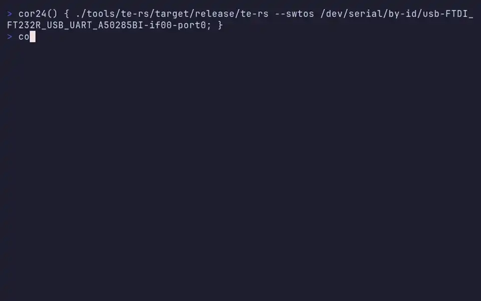

# SWTOS -- Software Wrighter Tiny Operating System

*A portable microkernel for educational and embedded systems.*

## Overview

SWTOS is a clean-room microkernel operating system inspired by MINIX IPC
principles but designed natively for small CPUs and FPGA soft cores. It
runs on the [COR24-TB](https://www.makerlisp.com/cor24-test-board) FPGA
development board (MakerLisp COR24 soft CPU, 1 MB SRAM, 101.7 MHz) and in
a companion software emulator.

SWTOS is implemented in [PL/SW](https://github.com/sw-embed/sw-cor24-plsw),
a PL/I-inspired systems programming language for the COR24 ISA.

## Hardware demo



[Full terminal transcript](docs/transcript.log) ·
[Reproducible VHS tape](docs/demos/cor24-terminal.tape)

## Windows frontend demo

[▶ Watch the tiled Windows frontend demo](videos/cor24-windows-demo.webm) ·
[▶ Watch two CPU hogs preempted independently](videos/cor24-preemption-demo.webm) ·
[Windows usage guide](docs/windows-usage.md) ·
[Reproducible Windows VHS tape](docs/demos/cor24-windows.tape) ·
[Dual-hog VHS tape](docs/demos/cor24-preemption.tape)

The Resources pane exposes `fp=` forced-preemption counts and the latest
interrupted `r0` sample as `cpu=`. The `cpu-hog` catalog image deliberately
contains no yield, syscall, I/O, IPC, sleep, or blocking operation; continued
Resources and Debugger response while those values advance is the acceptance
proof for preemptive time slicing.
The Debugger can read coherent saved frames with `regs 2` and `regs 3`, then
queue safe termination with `kill 2`; the recording demonstrates both counters
progressing and endpoint 3 continuing after endpoint 2 leaves Resources.

### Key Features

- **Synchronous message-passing IPC** -- `send`, `receive`, `sendrec`
- **Resident object catalog** -- programs cataloged at build time, not
  loaded from a filesystem
- **UART-hosted virtual timer** -- preemptive scheduling via heartbeat
  frames from the host terminal, with cooperative fallback
- **No MMU required** -- single address space with logical process
  isolation (separate stacks, no shared writable globals)
- **No hardware multiply or floating point required**
- **Entire system is one flat binary** -- kernel, services, and apps
  compiled and linked together
- **Emulator-first** -- runs identically on hardware and in the emulator

## Architecture

```
+-----------------------------------+
| Applications                      |
+-----------------------------------+
| Resident Services (tty, shell)    |
+-----------------------------------+
| SWTOS Microkernel                 |
|   scheduler, IPC, timers, heap    |
+-----------------------------------+
| COR24 HAL                         |
|   UART, GPIO, SPI, I2C            |
+-----------------------------------+
```

## Documentation

See [docs/architecture.md](docs/architecture.md) for the implemented system
architecture, [docs/preemptive-multitasking.md](docs/preemptive-multitasking.md)
for the UART-clock scheduling design and ADD-runway implementation,
[docs/user-guide.md](docs/user-guide.md) for general operation, and
[docs/windows-usage.md](docs/windows-usage.md) for the tiled frontend,
scrollback, process monitoring, and debugger workflows.

See [docs/plan.md](docs/plan.md) for the full development plan including
design philosophy, memory map, kernel subsystems, UART heartbeat protocol,
resident catalog design, milestones, and risk assessment.

## Repository layout

Source lives under a directory that names its role; the repository root holds
no build inputs.

```
include/          PL/SW macro headers (.msw) shared by every image
hal/cor24/        COR24 kernel and HAL assembly (scheduler, preemption,
                  context switch, protocol, SPI/I2C drivers)
catalog/          catalog.toml manifest and providers.toml
catalog/images/   cataloged program sources (cpu-hog.s, embedded-hello.s,
                  embedded-ping.plsw) with a .toml descriptor each
tests/            image sources and their test drivers, including
                  catalog-shell.plsw -- the primary scheduled shell image
scripts/          build, packaging, capture, and terminal launchers
tools/            te-rs frontend, debug adapter, plsw.lgo, built tools/bin/
docs/demos/       VHS tapes; docs/ holds the design and validation records
build/            all generated artifacts (ignored)
```

The scheduled shell used by the demos and the preemption proof is built from
`tests/catalog-shell.plsw` plus `hal/cor24/*.s`; `tests/system.plsw` is the
older direct-call compatibility image, and `tests/smoke-test.{s,plsw}` are the
Milestone 0 fixtures that still gate the build.

## Building

Requires the PL/SW toolchain (compiler, assembler, and linker):

- [sw-cor24-plsw](https://github.com/sw-embed/sw-cor24-plsw) -- PL/SW compiler
- `cor24-asm` -- COR24 assembler
- `link24` -- FIXUP-based linker
- `meta-gen` -- cross-module symbol and FIXUP metadata generator

```
just plsw-system
```

Run the complete noninteractive emulator acceptance gate with:

```
just emulator-acceptance
```

The gate runs its component recipes sequentially because storage-provider
negative tests intentionally mutate shared generated media fixtures. Inspect
the exact ordered recipe list with `./scripts/emulator-acceptance.sh --list`.
Each run writes `build/emulator-acceptance/report.json` with revision and
worktree identity, tool versions and hashes, UTC timestamps, durations, and
per-recipe results. Use `./scripts/emulator-acceptance.sh --report PATH` to
select a different report destination.

The resident catalog is generated from `catalog/catalog.toml`. To regenerate
it and verify that the checked-in PL/SW descriptor table is current and
compiles into the complete system image:

```
just catalog-smoke
```

The first embedded executable format is also defined and validated. Its
27-byte header records `C24IMG` magic, version, text/data/BSS word counts,
entry offset, relocation count, and a payload checksum. Build the deterministic
loader fixture and exercise corruption rejection with:

```
just cor24-image-smoke
```

The COR24-side version 1 loader now parses that header, copies text/data into
RAM, clears BSS, and computes the relocated entry address. Verify the target
loader independently with:

```
just cor24-loader-smoke
```

That loader proof supplies the copy/BSS/entry mechanics used by embedded
catalog dispatch.

The first end-to-end embedded program is now cataloged as `embedded-hello`.
`run embedded-hello` uses the same scheduled-shell lookup as resident programs,
copies its validated payload into executable RAM, calls the loaded entry (which
prints `E`), then returns through `TASK_EXIT`. The image smoke also assembles
the payload source and proves its bytes match the manifest.

Embedded text/data/BSS is allocated per child from the same reclaimable EBR
generation as its state and stack. Scheduled dispatch decodes full 24-bit
header sizes and entry offsets, stores the private allocation and relocated
entry in that process descriptor, and releases them after the last child exits.
The reclamation stress now runs 20 resident/embedded cycles.

`embedded-ping` is a second nonresident application compiled from PL/SW. Its
17-byte procedure is stored as six COR24 words with one unreachable padding
byte and prints `P` when loaded. Catalog linking now discovers every declared
image manifest rather than naming one fixture. The composite SPI proof runs
`embedded-hello`, then `embedded-ping`, then resident Counter, demonstrating
distinct flash extents and sequential descriptor reuse.

Each child process snapshots a nonresident descriptor into slot-owned storage
before loading it. A later SPI catalog lookup can therefore reuse the transient
provider result without changing a live process's name, metadata, or flash
extent. `just scheduled-concurrent-spi-smoke` fills both child slots with the
two flash applications, verifies their descriptor addresses and extents differ,
then schedules both to completion.
`just scheduled-concurrent-sd-smoke` applies the same two-live-child proof to
the cached SD provider and additionally requires both slots and their shared
allocation generation to be reclaimed after the join.
`just scheduled-composite-sd-mixed-smoke` keeps resident Counter and an
SD-backed image live together, verifies the resident descriptor remains direct
while the external child owns its snapshot, and schedules both to completion.
`just scheduled-composite-sd-mixed-reverse-smoke` loads the SD child first and
then performs the resident lookup. The already-live external child retains its
snapshot and executable despite the composite provider switching back to its
resident source for the second spawn.
The 39-byte process record is fully allocated to the public `PROC_DESC` ABI;
notably, byte offset 21 is `PD_SENDER`, not scratch storage. The canonical field
map is `hal/cor24/proc-desc.toml`, and `just proc-desc-abi-smoke` checks all 13
three-byte fields against the PL/SW declarations in `include/swtos.msw`.
External image-source ownership therefore lives in explicit sidecar words next
to the child slots. Composite lookup returns its concrete reader through an
explicit callback word rather than a memory-versus-external flag. Spawn copies
that result into the child sidecar, and the synchronous loader uses the bound
callback for every C24IMG read.

Catalog lookup and embedded loading now share an explicit two-operation image
provider record. The in-memory provider implements `find` over the generated
descriptor table and `read` over embedded image bytes; shell lookup and loader
header/payload reads dispatch through those callbacks. Block, W25Q32 SPI, and
SD providers implement the same seam.

Embedded descriptors carry their complete stored-image word length. Provider
reads reject requests whose `offset + count` exceeds that byte limit and return
an explicit status consumed by the loader. The multislot proof includes an
intentional final-byte overrun and requires the provider to report `BOUNDS`.

`TASK_SPAWN_RESULT` exposes `0` for success, `1` for provider/load failure,
and `2` when no process slot is free. Failed embedded loads roll the tentative
state/image allocation back, keep the slot free, and return control to PL/SW;
the shell reports `ERROR` rather than hanging or halting the kernel. The
multislot proof injects one read failure, requires `RECOVERED`, then runs both
Counter children to demonstrate continued scheduler health.

A second provider adapts the same interface to eight-byte block reads. Image
assembly is padded to a complete host-backed block without changing its logical
descriptor length. `just scheduled-block-provider-smoke` switches providers,
loads `embedded-hello` across block boundaries, requires `EBLOCK`, then restores
the default memory provider.

The block provider also implements `find` without walking the resident table.
Catalog generation emits an eight-byte header followed by 24-byte records: a
16-byte NUL-terminated name, descriptor ordinal, and seven reserved bytes.
Block-backed
lookup reads those records, resolves the ordinal into the generated descriptor
table, and then loads the selected image through block reads.

`just cor24-storage-smoke` builds and validates `build/catalog-images/swtos-storage.bin`,
a deterministic eight-byte-block media image suitable for the emulator's
host-file-backed flash device. Resident entries have zero extents; embedded
entries use the seven reserved record bytes for a three-byte image offset,
three-byte logical image length, and flags, and point to block-aligned,
checksum-validated C24IMG payloads.

`hal/cor24/spi.s` implements the platform's bit-banged SPI master contract at
`FF0030` (MOSI/MISO), `FF0031` (SCLK), and `FF0032` (active-low select), using
mode 0 and MSB-first byte exchange. `just spi-flash-read-smoke` attaches the
generated media to the emulator's W25Q32 model and proves the target HAL reads
its catalog header over the emulated wire protocol. The same HAL exposes an
eight-byte block read that issues a W25Q32 `03h` transaction with a 24-bit
address; the proof resolves the first embedded image's current extent from the
validated generated media and reads its block-aligned `C24IMG` magic.

`just scheduled-spi-provider-smoke` exercises the complete storage path. The
scheduled catalog manager finds `embedded-hello` by reading flash catalog
records, copies its runtime descriptor with the media offset substituted for
the resident image address, and routes arbitrary header and payload reads
through the W25Q32 block HAL. The loaded PL/SW application executes from its
private allocation and returns through the normal scheduler path.
The provider caches its most recently fetched eight-byte block, so sequential
header, catalog, and payload bytes do not repeat the same W25Q32 transaction.
The scheduled SPI proof requires at least one real fetch and one cache hit.
After copying text and data, the target loader computes standard CRC-32 with a
split 24-bit/8-bit accumulator and compares the header's stored low 24 bits
before making the entry runnable. The SPI proof corrupts a payload byte and
requires `CRCFAIL`, demonstrating rejection before execution.
Before allocation, the loader also reads and verifies the six-byte `C24IMG`
magic, requires a nonzero text segment and an entry offset within it, rejects
24-bit overflow while combining text/data/BSS sizes, and requires the computed
stored payload length to equal the descriptor extent.
SPI catalog lookup validates the complete eight-byte record tail before copying
a runtime descriptor: ordinal, image-present flag, block alignment, logical
length, non-wrapping end address, and the four-megabyte W25Q32 capacity bound.
The index header must describe exactly the bounded fixed-record region, every
catalog read must report success, and each 16-byte name field must contain a
NUL before comparison, preventing malformed media from extending a lookup into
adjacent target state.
Its eight-byte header is count, version `1`, ASCII `SWT`, and the big-endian low
24 bits of standard CRC-32 over every 24-byte record. Host generation and target
lookup compute the same checksum, authenticating names and extents together.

The SPI-enabled interactive shell uses a composite provider: resident programs
are resolved without touching the bus, and nonresident names fall through to
the flash catalog. Run it with:

```
just plsw-system-spi-interactive
```

In that session, `run embedded-hello` loads from the attached generated flash
media; `run embedded-ping` loads the second PL/SW image; and menu choices and
commands such as `run counter` remain resident.

The same resident-first shell can use the identical storage image through the
emulator's SD-card device:

```
just plsw-system-sd-interactive
```

`just scheduled-composite-sd-smoke` runs both nonresident applications and
resident Counter in one scripted session, proving the shell behavior is
independent of whether its external provider is W25Q32 or SD.
Both targets use one composite implementation. Link configuration supplies an
external preparation callback and read callback; resident lookup, fallback,
catalog validation, and source tracking are shared.
The supported configurations live in `catalog/providers.toml`. Each entry
declares the initial provider plus its preparation and read callbacks, so a new
provider does not require another conditional branch in the link script.
`just provider-config-smoke` validates the memory, W25Q32, and SD mappings.

Boot initializes that table and scans its flags rather than naming the shell
entry directly. To verify metadata-driven `IMAGE_AUTOSTART` dispatch:

```
just autostart-smoke
```

The interactive shell retains choices `0` through `3` and also accepts
`run <name>`, for example `run counter`, `ls` to enumerate every resident
program and service, and `ps` to inspect process slots. Lookup scans program descriptors by name and dispatches
the linked resident entry. Verify lookup and listing with:

```
just catalog-run-smoke
just catalog-list-smoke
```

The scheduler-side catalog spawn proof separately compiles and links a PL/SW
resident task with the assembly kernel, consumes descriptor stack/state sizes,
allocates private EBR regions, and launches two contexts sharing that PL/SW
entry point:

```
just catalog-spawn-smoke
```

The expected task output is `A1`, `B1`, `A2`, `B2`, demonstrating independent
zero-initialized state for both instances. An assembly trampoline translates
the scheduler's initial `r0` state pointer into the normal PL/SW stack calling
convention. Boot starts only task A; while its PL/SW frames are live, it calls
the exported `TASK_SPAWN(descriptor)` service with a descriptor pointer held in
private state to create task B, then both tasks call back into the scheduler to
yield.

### Scheduled shell

The persistent PL/SW menu provides six demos:

- `1`: Hello waits for a key in its own process.
- `2`: Counter prints `B1` and `B2`.
- `3`: Uptime prints terminal-connection elapsed time.
- `4`: Clock prints host-local wall time.
- `5`: Multitask prints `B1 C1 B2 C2` from two cooperative workers.
- `6`: UART Test continuously transmits `A-Z` then `0-9` through the
  hardware-flow-controlled UART. Reset the board to leave this saturation test.

Each app releases its process slot and returns to the preserved menu context.
Run the smoke test or start an interactive session with:

```
just scheduled-shell-smoke
just scheduled-shell-interactive
```

Shell commands include:

- `ls` and its CP/M-style alias `dir` list catalog entries.
- `ps` lists process slots; `ps -l` shows detailed activity counters.
- `run <name>` launches a program descriptor.
- `help` lists commands.
- `uname` identifies SWTOS and COR24.
- `df` summarizes generated catalog/image totals.
- `du` lists generated external-image sizes.
- `stat <name>` reports catalog metadata; `stat <endpoint>` reports process
  identity, state, allocation, dispatch/yield, IPC, and TTY counters.

Catalog-dependent utility text is generated from `catalog/catalog.toml` and
the image manifests. Displayed sizes therefore stay tied to build inputs.

The scheduler join service suspends the shell until a selected app exits.
`TASK_EXIT` then restores the saved EBR arena pointer, reclaiming private state
and stack as one LIFO allocation. Verify reuse with
`just scheduled-reclaim-smoke`.

The scheduler scans a three-entry process table. Two child slots can run
concurrently. `just scheduled-multislot-smoke` verifies their independent
state and round-robin `B1 C1 B2 C2` output. `ps` walks the same table and prints
each endpoint as `FREE` or `RUNNABLE`.
Detailed counters are unsigned 24-bit values and wrap naturally; scheduler
dispatches describe activity, not CPU utilization.

Scheduled input passes through four kernel virtual-TTY channels. Empty reads
block and yield, foreground ownership isolates concurrent readers, and child
exit transfers focus without allowing one process to consume another's input.

The heartbeat-aware frontend accepts `--image`, so the same byte stuffing,
Ctrl-] translation, and line-ending filtering serve both the compatibility and
scheduler-integrated images. The latter is ready to become the primary demo.

Builds produce flat `.bin` images at address zero. Single-module assembly
artifacts may also use `.lgo` containers.

### Hardware UART

Create board artifacts with `just hardware-validation-bundle`. See
[docs/hw-validation.md](docs/hw-validation.md) for the 921,600-baud RTS/CTS
procedure and acceptance record.
Scheduled builds and the validation bundle include complete, zero-preserving
`.lgo` upload images with explicit entry records. Use those repository-recipe
outputs instead of manually converting flat binaries.

Run the Rust frontend with:

```sh
cargo run --release --manifest-path tools/te-rs/Cargo.toml -- --swtos DEVICE
```

The uploader drains monitor echo continuously so RTS/CTS cannot deadlock. The
validated load profile is `--sync --byte-delay 100 --delay 10`.

The former direct-call image remains available as a compatibility reference:

```
just plsw-system-compat-interactive
```

Scheduled command coverage is available with `just scheduled-catalog-smoke`.
Catalog generation emits both `include/catalog_generated.msw` and
`hal/cor24/catalog_generated.s`; the direct-call and scheduled images therefore
share names, kinds, entry metadata, stack/state sizes, and flags from one TOML
manifest.

To test the Clock app without an interactive terminal:

```
just clock-smoke
```

To verify separate PL/SW compilation and linking:

```
just plsw-link-smoke
```

This independently compiles an entry module and a library module, performs
two-pass assembly, applies cross-module FIXUPs with `link24`, and checks the
linked program's emulator output.

To exercise the cooperative COR24 context switch:

```
just context-switch-smoke
```

The test creates two task contexts on disjoint EBR stacks, alternates them
through `yield`, verifies saved register sentinels, and requires the UART
sequence `A1`, `B1`, `A2`, `B2`, `A3`, `B3`.
The complete output begins with `SWTOS M1 C0`: `C0` records that no heartbeat
has synchronized the clock while cooperative scheduling and IPC remain live.
The same fallback proof has an explicit recipe:

```
just cooperative-fallback-smoke
```

The same executable also provides the first synchronous IPC proof:

```
just ipc-smoke
```

The TTY task starts first and blocks in `receive`. The client fills a fixed
seven-word `TTY_WRITE` message, blocks in `send`, and wakes the TTY task. The
TTY task copies the message to a private buffer, acknowledges the sender, and
produces the alternating output, then replies synchronously. The task code
calls reusable `send`, `receive`, and `sendrec` kernel entries using the PL/SW
stack calling convention.

To verify UART transport framing and the virtual clock arithmetic:

```
just heartbeat-smoke
```

The test distinguishes ordinary bytes from escaped `0xFF` data and heartbeat
control frames, then verifies a three-tick delta across the 24-bit wrap from
`0xFFFFFE` to `0x000001`. It also scans two sleeping entries with deadlines
two and three and verifies that both become runnable at monotonic tick three.
UART bytes are parsed one per interrupt, and a foreground-work sentinel proves
that `jmp (ir)` resumes interrupted execution.
`just interrupt-context-capability-smoke` verifies that `ir` remains
indirect-only and that COR24's `C7` absolute-immediate jump resumes without
clobbering restored registers. `just preemption-runway-smoke` proves exact PC
recovery through the software ADD runway. The definitive integrated test is:

```
just preemption-acceptance
```

It runs a private `cpu-hog` containing no yield, syscall, UART, IPC, sleep, or
blocking operation. UART heartbeats expire its quantum, the kernel snapshots
every live byte overwritten by the runway, recovers and restores its IRQ
context, and schedules other work. The test requires forced-preemption and CPU
progress samples to advance and a debugger request to complete while the hog
continues running. Normal yield/block switches remain the inexpensive path;
forced preemption is the bounded trust-but-verify backstop.

The first I2C client reuses the proven COR24 DS1307 transaction: a reusable
bit-banged HAL at `0xFF0020`/`0xFF0021` sets register zero, performs a repeated
START, reads BCD seconds/minutes/hours, NAKs the final byte, and issues STOP.
`just i2c-ds1307-smoke` runs a PL/SW client against the Rust emulator's
`ds1307@0x68` device, requires `12:34:56`, checks every logged bus event, and
also verifies that an absent device returns the NAK error path.
The same proof attaches `ssd1306@0x3C`, initializes horizontal addressing, and
renders that time as eight 5x8 glyphs. `just i2c-oled-clock-smoke` verifies the
complete 56-write OLED command/data sequence, representative framebuffer
columns, and the missing-display NAK path.

The SPI HAL also implements the standard SD-card initialization sequence and
single-block CMD17 read used by the existing COR24 demo. `just
spi-sdcard-smoke` creates two distinguishable sectors, reads sector one into a
512-byte PL/SW array through the Rust emulator's host-file-backed `sdcard`
device, checks its first sixteen and final bytes, and proves a missing card is
reported as `SD ERROR`.

SD storage also implements the catalog image-provider contract. Its arbitrary
byte reads are backed by a reusable 512-byte sector cache, so the existing
catalog authentication, extent checks, C24IMG validation, CRC, and loader need
no SD-specific path. `just scheduled-sd-provider-smoke` loads
`embedded-hello` from the standard storage image with exactly one sector fetch
and rejects a corrupted SD-backed payload before execution. The same smoke test
builds a sector-aligned fixture with the executable beginning at byte 512; it
requires two physical fetches and proves the cache turns over from the catalog
in sector zero to authenticated executable data in sector one.
A larger 546-byte C24IMG then exercises a single payload read spanning sectors
one and two. Its compact manifest uses `payload_zero_words` plus an authenticated
nonzero suffix in sector two, and the target requires three total sector fetches
before CRC validation and execution succeed. Truncating the emulated medium at
the end of sector one proves a missing or zero-filled sector-two read rejects
the partial image before its PL/SW entry can execute.
Corrupting only that authenticated suffix also exercises recovery in one
scheduler session. Twenty alternating pairs require the first spawn to report a
load failure and `embedded-ping` to be found, loaded from later SD sectors,
authenticated, and executed through the same provider. A target-side assertion
then checks that no child remains and the arena cursor equals its generation
mark.

## License

Copyright (c) 2026 Michael A Wright

MIT -- see [LICENSE](LICENSE).
The standalone notice is also recorded in [COPYRIGHT](COPYRIGHT).
